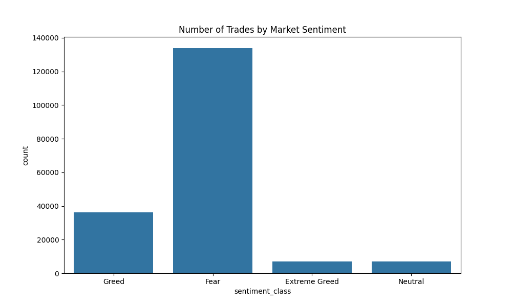
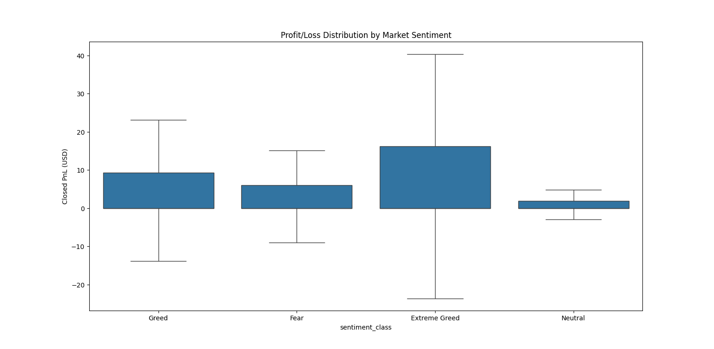
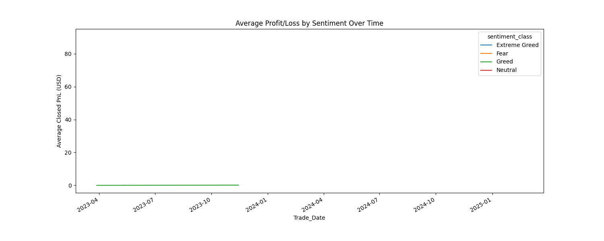

 #  Trader Behavior Insights using Bitcoin Market Sentiment

##  Overview

This project analyzes the relationship between **trader performance** and **Bitcoin market sentiment** (Fear & Greed Index). It aims to uncover insights into how sentiment affects returns, risk, and win rates in cryptocurrency trading, helping shape more intelligent strategies.

---

## 📂 Datasets Used

1. **Fear & Greed Index**
   - Columns: `date`, `value`, `classification`
   - [Download Link](https://drive.google.com/file/d/1PgQC0tO8XN-wqkNyghWc_-mnrYv_nhSf/view?usp=sharing)

2. **Hyperliquid Historical Trader Data**
   - Columns include: `Account`, `Coin`, `Execution Price`, `Size`, `Closed PnL`, `Timestamp`, etc.
   - [Download Link](https://drive.google.com/file/d/1IAfLZwu6rJzyWKgBToqwSmmVYU6VbjVs/view?usp=sharing)

---

## 📊 Sentiment Summary Table

| Sentiment       | Avg PnL | Win Rate | Volatility | Trade Count | Avg Trade Size | Return/Risk Ratio |
|-----------------|--------:|----------:|------------:|-------------:|----------------:|-------------------:|
| Extreme Greed   | 25.42   | 49.0%     | 306.17      | 6962         | 5660.27         | 0.0830             |
| Fear            | 50.05   | 41.5%     | 909.12      | 133871       | 5259.98         | 0.0551             |
| Greed           | 87.89   | 44.6%     | 1148.34     | 36289        | 3182.88         | 0.0765             |
| Neutral         | 22.23   | 31.7%     | 633.70      | 7141         | 3058.85         | 0.0351             |

> 🔍 **Insight:** Although Fear and Greed have high trade volumes, Greed sentiment provides a better balance of return and risk. Neutral sentiment days perform the worst overall.

---

## 📈 Visualizations

### 1.  Number of Trades by Sentiment📊

> Most trades occurred during Fear and Greed days, showing higher market activity during emotionally charged conditions.

---

### 2.  Profit/Loss Distribution by Sentiment💸

> Greed days showed the highest potential gains but also larger variation, indicating higher volatility. Extreme Greed had tighter distributions.

---

### 3. Average PnL Over Time by Sentiment⏱️ 

> This time series reveals dynamic shifts in performance, with noticeable spikes during Greed sentiment periods.

---

## 📚Statistical Testing

- ANOVA test confirms that trader performance on **Greed vs Fear** days is statistically different (**p-value < 0.0001**).
- This shows that market sentiment **does affect** trader behavior in measurable ways.

---

## 🤖Machine Learning

A simple Random Forest Regressor was trained using:
- Features: `sentiment_class`, `Size Tokens`, `Fee`
- Target: `Closed PnL`

**R² Score:** ~0.10  
> 🔍 Insight: While sentiment is impactful, it alone isn't a strong predictor of profitability — indicating the need for combining multiple factors.

---

## 🧪 Tools & Technologies

- Python (Pandas, NumPy)
- Visualization: Seaborn, Matplotlib
- Scikit-learn (ML)
- SciPy (ANOVA Testing)

---

## 📁 Files in This Repository

| File                          | Description                                     |
|------------------------------|-------------------------------------------------|
| `sentiment_trading_analysis.py` | Full code of the analysis                     |
| `summary_insights.csv`         | Final sentiment-wise metrics                  |
| `plots/sentiment_distribution.png` | Bar plot of trades per sentiment          |
| `plots/pnl_boxplot.png`         | Box plot of PnL per sentiment               |
| `plots/pnl_time_series.png`     | Time series of PnL by sentiment              |

---

## 🙋🏻‍♀️ About Me

**Mitali Jain**  
Email: [mitalijain2805@gmail.com]  
LinkedIn: [www.linkedin.com/in/mitali-jain-106630250]  

---

## 🚀 Purpose of This Project

This project is part of my submission for the **Junior Data Scientist – Trader Behavior Insights** role.  
Feel free to contact me for more details or feedback!

